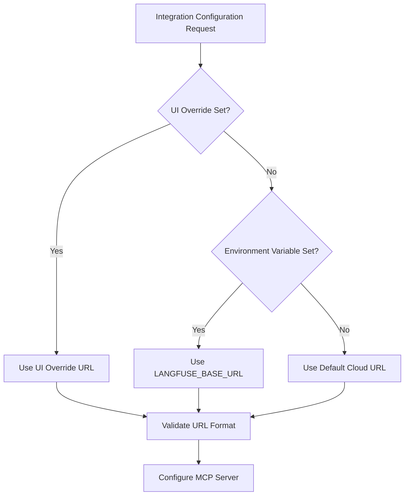

# Langfuse Self-Hosted Server Support Implementation Plan

## Overview

This document outlines the implementation plan for adding self-hosted Langfuse server support to the existing Langfuse integration. The enhancement will allow users to specify a custom base URL for their self-hosted Langfuse instances while maintaining backward compatibility with the cloud version.

## Current State Analysis

### Existing Implementation
- **File**: [`packages/core/src/services/integrations/hostedTypes/configs/langfuse.ts`](packages/core/src/services/integrations/hostedTypes/configs/langfuse.ts)
- **Current Environment Variables**:
  - `LANGFUSE_PUBLIC_KEY` (required)
  - `LANGFUSE_SECRET_KEY` (required)
- **Limitation**: Only supports Langfuse cloud instance
- **MCP Package**: Uses `@modelcontextprotocol/inspector`

### Similar Patterns in Codebase
The GitLab integration already implements a similar pattern for self-hosted support:
- **File**: [`packages/core/src/services/integrations/hostedTypes/configs/gitlab.ts`](packages/core/src/services/integrations/hostedTypes/configs/gitlab.ts)
- **Pattern**: Optional `GITLAB_API_URL` environment variable for self-hosted instances

## Requirements

1. **Environment Variable Support**: Add `LANGFUSE_BASE_URL` environment variable
2. **Default Behavior**: Use Langfuse cloud URL when not specified
3. **UI Override**: Allow users to override base URL through integration settings interface
4. **Backward Compatibility**: Existing integrations continue to work unchanged
5. **Configuration Priority**: UI override > Environment variable > Default cloud URL

## Implementation Plan

### Phase 1: Update Langfuse Configuration

**File**: [`packages/core/src/services/integrations/hostedTypes/configs/langfuse.ts`](packages/core/src/services/integrations/hostedTypes/configs/langfuse.ts)

#### Changes Required:
1. Add `LANGFUSE_BASE_URL` environment variable configuration
2. Set as optional with appropriate description and placeholder
3. Follow GitLab integration pattern for consistency

#### Expected Configuration:
```typescript
const LANGFUSE_MCP_CONFIG: HostedIntegrationConfig = {
  command: npxCommand({
    package: '@modelcontextprotocol/inspector',
    args: 'node ./build/index.js',
  }),
  envSource: 'https://github.com/langfuse/langfuse-mcp',
  env: {
    LANGFUSE_PUBLIC_KEY: {
      label: 'LANGFUSE_PUBLIC_KEY',
      placeholder: 'your-public-key',
      required: true,
    },
    LANGFUSE_SECRET_KEY: {
      label: 'LANGFUSE_SECRET_KEY',
      placeholder: 'your-secret-key',
      required: true,
    },
    LANGFUSE_BASE_URL: {
      label: 'Langfuse Base URL (optional)',
      description: 'For self-hosted Langfuse instances. Leave empty to use Langfuse cloud.',
      placeholder: 'https://your-langfuse-instance.com',
      required: false,
    },
  },
}
```

### Phase 2: UI Integration Settings Enhancement

**Target Files**: Integration settings components in [`apps/web/`](apps/web/)

#### Changes Required:
1. Add "Base URL" field to Langfuse integration settings interface
2. Implement URL validation
3. Provide clear labeling and help text
4. Allow override of environment variable setting

#### UI Field Specifications:
- **Field Type**: URL input
- **Label**: "Langfuse Base URL (optional)"
- **Placeholder**: "https://your-langfuse-instance.com"
- **Help Text**: "Leave empty to use Langfuse cloud. Specify URL for self-hosted instances."
- **Validation**: URL format validation
- **Required**: No

### Phase 3: Configuration Priority Logic

#### Implementation Priority Order:
1. **UI Override** (Highest Priority): Value set in integration settings interface
2. **Environment Variable**: `LANGFUSE_BASE_URL` if set
3. **Default Fallback**: Langfuse cloud URL (`https://cloud.langfuse.com`)

#### Logic Flow:


### Phase 4: Environment Variable Handling

#### Default URL Configuration:
- **Cloud URL**: `https://cloud.langfuse.com`
- **Fallback Behavior**: Automatically use cloud URL when no custom URL specified
- **Error Handling**: Validate URL format and provide helpful error messages

#### Environment Variable Processing:
1. Check for `LANGFUSE_BASE_URL` environment variable
2. Validate URL format if provided
3. Fall back to cloud URL if not provided or invalid
4. Pass configuration to MCP server

### Phase 5: Testing Strategy

#### Test Scenarios:
1. **Default Cloud Behavior**:
   - No environment variable set
   - No UI override
   - Should use Langfuse cloud URL

2. **Environment Variable Only**:
   - `LANGFUSE_BASE_URL` set to self-hosted URL
   - No UI override
   - Should use environment variable URL

3. **UI Override Priority**:
   - `LANGFUSE_BASE_URL` set to one URL
   - UI override set to different URL
   - Should use UI override URL

4. **Invalid URL Handling**:
   - Invalid URL format in environment variable
   - Invalid URL format in UI
   - Should show appropriate error messages

5. **Backward Compatibility**:
   - Existing integrations without new environment variable
   - Should continue working with cloud URL

#### Validation Tests:
- URL format validation (protocol, domain, etc.)
- Empty/null value handling
- Special characters in URLs
- Port number support
- HTTPS/HTTP protocol support

## Technical Considerations

### URL Validation Rules:
- Must include protocol (http:// or https://)
- Must have valid domain format
- Support for custom ports
- No trailing slash normalization

### Error Handling:
- Clear error messages for invalid URLs
- Graceful fallback to cloud URL on configuration errors
- User-friendly validation feedback in UI

### Security Considerations:
- Validate URL format to prevent injection attacks
- Ensure HTTPS is recommended for production
- No sensitive data in URL parameters

## Benefits

1. **Flexibility**: Supports both cloud and self-hosted Langfuse deployments
2. **User Experience**: Clear UI for configuration without requiring environment variable knowledge
3. **Backward Compatibility**: Existing setups continue to work unchanged
4. **Consistency**: Follows established patterns from other integrations (GitLab)
5. **Configurable**: Multiple levels of configuration (environment variable + UI override)
6. **Enterprise Ready**: Enables enterprise customers to use their own Langfuse instances

## Implementation Timeline

### Phase 1: Configuration Update (1-2 hours)
- Update Langfuse configuration file
- Add new environment variable definition

### Phase 2: UI Enhancement (3-4 hours)
- Identify and update integration settings components
- Add URL input field with validation
- Implement help text and user guidance

### Phase 3: Logic Implementation (2-3 hours)
- Implement configuration priority logic
- Add URL validation and error handling
- Ensure proper fallback behavior

### Phase 4: Testing (2-3 hours)
- Unit tests for configuration logic
- Integration tests for UI components
- End-to-end testing with both cloud and self-hosted scenarios

### Phase 5: Documentation (1 hour)
- Update integration documentation
- Add examples for self-hosted configuration

**Total Estimated Time**: 9-13 hours

## Files to Modify

### Core Configuration:
- [`packages/core/src/services/integrations/hostedTypes/configs/langfuse.ts`](packages/core/src/services/integrations/hostedTypes/configs/langfuse.ts)

### UI Components:
- Integration settings components in [`apps/web/`](apps/web/)
- Form validation logic
- Environment variable display components

### Type Definitions:
- Update type definitions if needed for new configuration options

## Success Criteria

1. ✅ Users can specify `LANGFUSE_BASE_URL` environment variable for self-hosted instances
2. ✅ UI provides clear option to override base URL in integration settings
3. ✅ Default behavior uses Langfuse cloud URL when no custom URL specified
4. ✅ Configuration priority works correctly (UI > Env Var > Default)
5. ✅ Existing integrations continue to work without changes
6. ✅ URL validation prevents invalid configurations
7. ✅ Error messages are clear and helpful
8. ✅ Integration works with both cloud and self-hosted Langfuse instances

## Next Steps

1. **Review and Approval**: Confirm implementation plan details
2. **Switch to Code Mode**: Begin implementation of the planned changes
3. **Iterative Development**: Implement and test each phase
4. **Integration Testing**: Verify functionality with both cloud and self-hosted scenarios
5. **Documentation Update**: Update user-facing documentation with new capabilities

---

*This implementation plan follows established patterns in the codebase and ensures backward compatibility while adding the requested self-hosted server support functionality.*